<div align="center">

# RL-Learning

**配置驱动的强化学习实验框架**

13 个环境 × 自研策略梯度算法 × Stable-Baselines3 对照基线 × 可视化实验台

[](https://www.python.org/)
[](https://gymnasium.farama.org/)
[](https://stable-baselines3.readthedocs.io/)
[](https://streamlit.io/)


[实验成果](#实验成果)　·　[Web 实验台](#web-实验台)　·　[快速开始](#快速开始)　·　[诊断案例](#诊断案例什么才算学会)　·　[学习路径](LEARNING_PATH.md)

</div>

---

## 这是什么

环境、算法、超参、日志——全部由一份 YAML 决定。新增一个实验只需要加配置，不用碰代码。

项目里有两套并行的算法实现，共用同一个 `BaseAlgorithm` 接口：

- **自研**（`REINFORCE` / `A2C` / `PPO`）—— 从零手写，注释里写明策略梯度定理、baseline 为何降方差、GAE 的 λ 在做什么、PPO 的 clip 到底限制了什么东西。刻意不复用 SB3 的训练循环：亲手写一遍「采样 → 算优势 → 算损失 → 反向传播」这条链路才是重点。
- **SB3**（`SB3-PPO` / `SB3-DQN` / `SB3-SAC` / `SB3-TD3` / `SB3-RecurrentPPO` / `SB3-A2C`）—— 适配成同一接口，用作对照基线。

两者**读同一份超参 profile**，所以对照实验天然同超参，学习曲线的差异才能归因到实现本身。

---

## Web 实验台

不想盯着终端时，用网页看实验进度和结果，也能直接发起训练。

<div align="center">
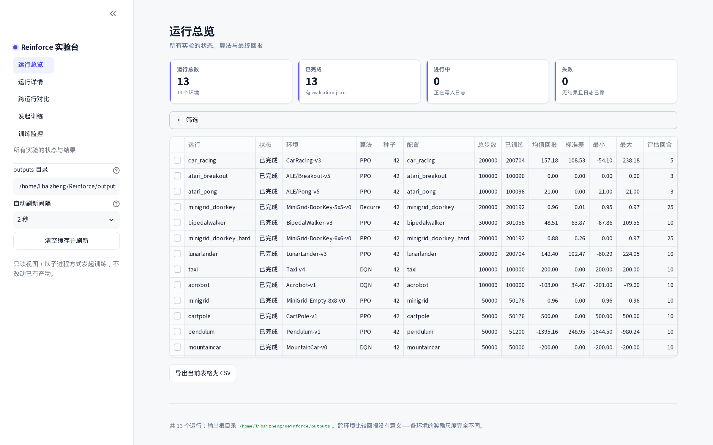
<br><sub><b>运行总览</b> —— 所有实验的状态、算法、种子、回报一屏看完，进行中的带进度与剩余时间</sub>
</div>

<br>

<table>
<tr>
<td width="50%" align="center">
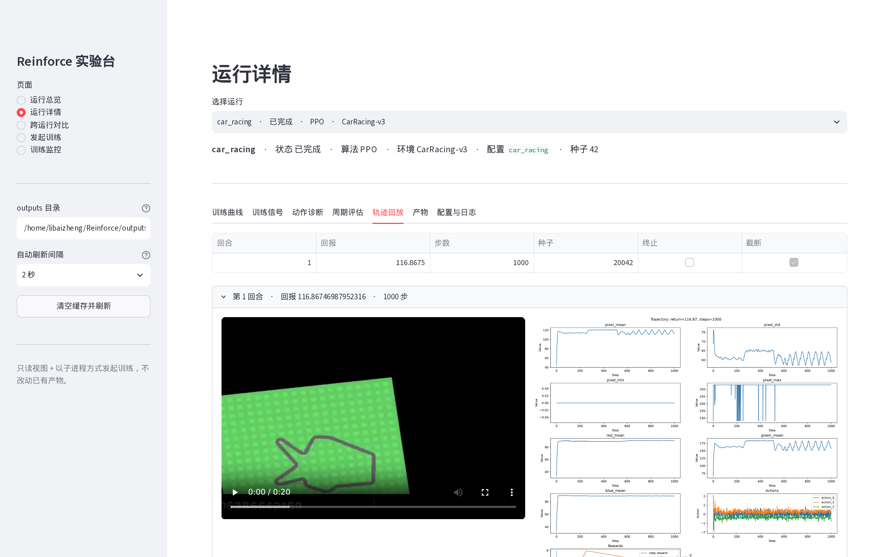<br>
<sub><b>轨迹回放</b> —— 策略视频与观测/动作曲线并排</sub>
</td>
<td width="50%" align="center">
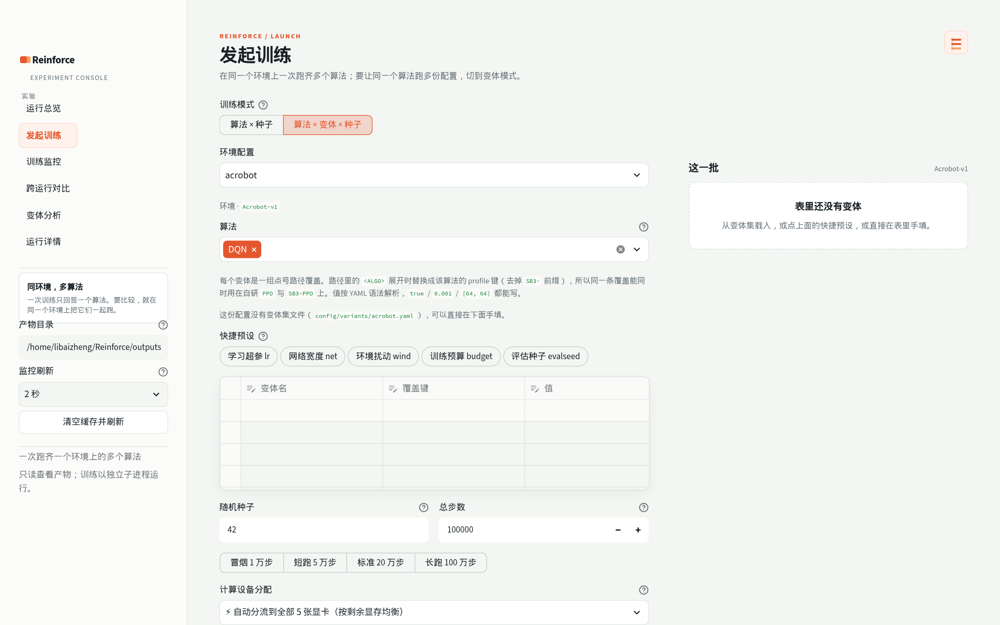<br>
<sub><b>发起训练</b>（变体模式）—— 一张 <code>变体名 | 覆盖键 | 值</code> 长表铺开同算法的多份配置</sub>
</td>
</tr>
<tr>
<td colspan="2" align="center">
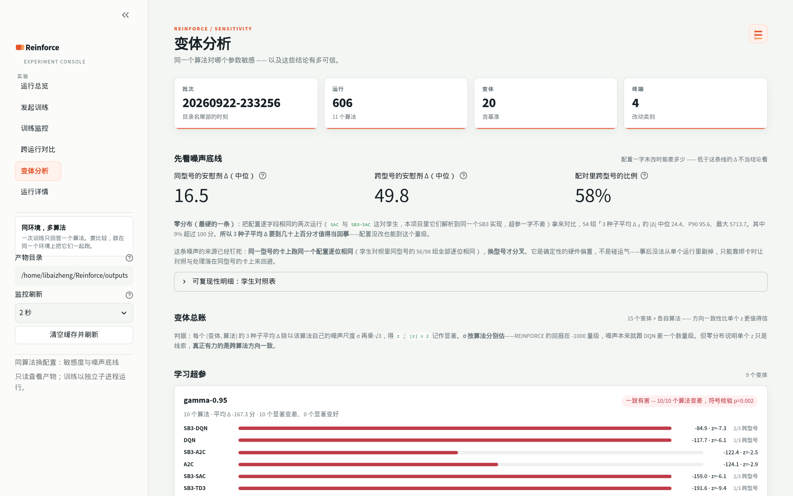<br>
<sub><b>变体分析</b> —— 先给噪声底线，再给各变体的敏感度与符号检验</sub>
</td>
</tr>
</table>

```bash
python -m pip install -r webui/requirements.txt   # 独立依赖，跑实验不需要
streamlit run webui/app.py

# 服务只监听 127.0.0.1，无桌面服务器上开隧道访问
ssh -N -L 8501:127.0.0.1:8501 <user>@<服务器>     # 然后打开 http://127.0.0.1:8501
```

六个页面覆盖完整工作流：

| 页面 | 内容 |
| --- | --- |
| **运行总览** | 状态统计、环境/算法/名称筛选、结果表格导出 |
| **运行详情** | 训练全程（主干曲线 · 跨面板联动的过程信号 · 动作分布 · 误差带 · 逐回合得分 · 录像）· 训练信号 · 动作诊断 · 周期评估 · 轨迹回放 · 产物 · 配置日志 |
| **跨运行对比** | 先选一类改动（基准 / 学习超参 / 环境扰动 / 训练预算 / 评估种子），再按算法分面看学习曲线（面板内独立 y 轴、跨面板联动刷选）+ 按族分组排名 |
| **发起训练** | 配置/算法/种子/步数/输出目录，命令行预览可复制；切到变体模式可以一次铺开同算法的多份配置 |
| **训练监控** | 进度条 · 剩余时间 · 实时信号曲线 · 日志尾，定时刷新可关 |
| **变体分析** | 同算法换配置的敏感度与噪声底线 |

<details>
<summary><b>更多界面截图</b></summary>

<br>

<div align="center">
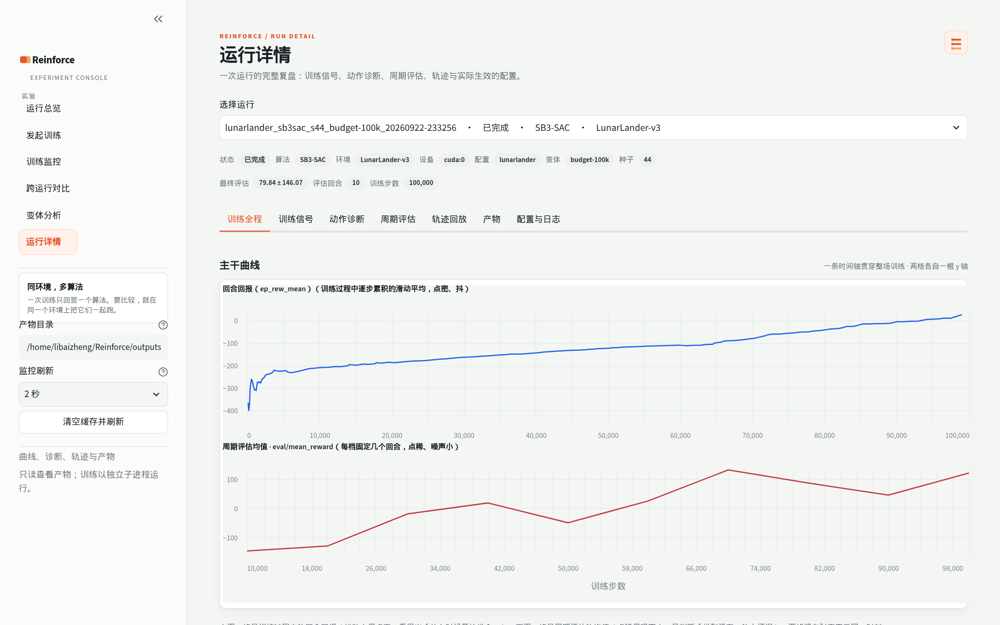<br>
<sub><b>运行详情</b> —— 「训练全程」：主干曲线 + 联动过程信号面板组</sub>
</div>

<br>

<table>
<tr>
<td width="50%" align="center">
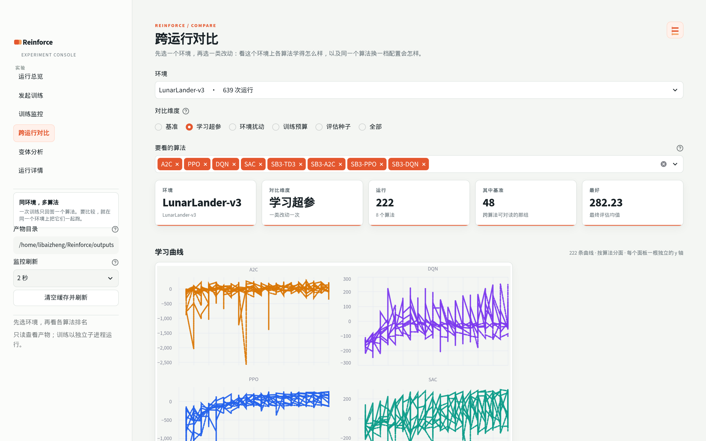<br>
<sub><b>跨运行对比</b> —— 按算法分面的学习曲线 + 按族分组的排名</sub>
</td>
<td width="50%" align="center">
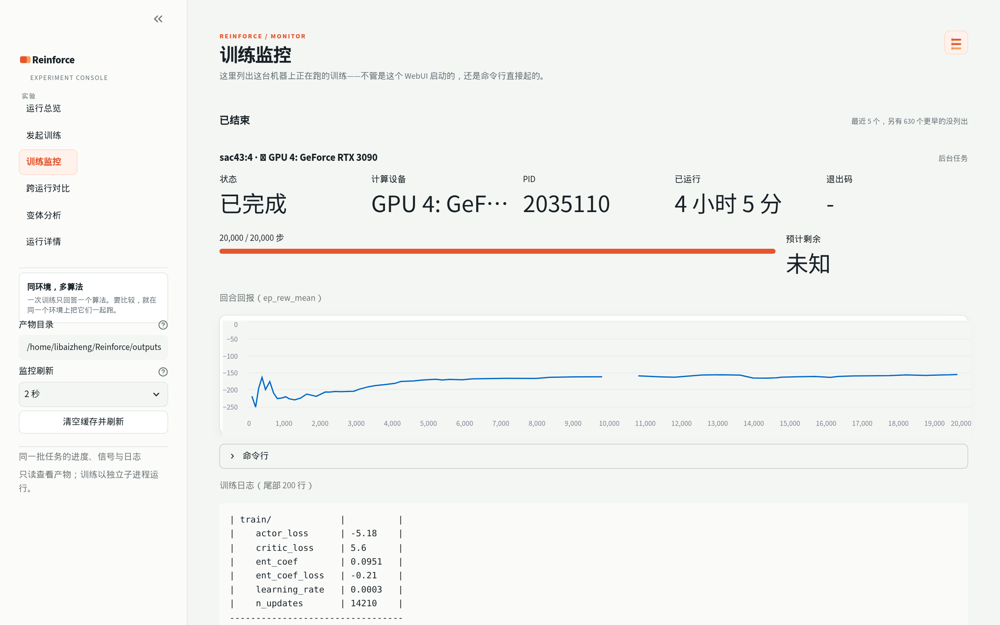<br>
<sub><b>训练监控</b> —— 实时进度、信号与日志</sub>
</td>
</tr>
</table>

</details>

训练以**子进程**方式启动并脱离页面运行——关掉浏览器、重启 Streamlit 都不会中断训练。详见 [`webui/README.md`](webui/README.md)。

---

## 实验成果

13 个配置各跑一次，下图是**真实训练曲线**（浅色为逐回合回报，深色为滑动平均）：

<div align="center">
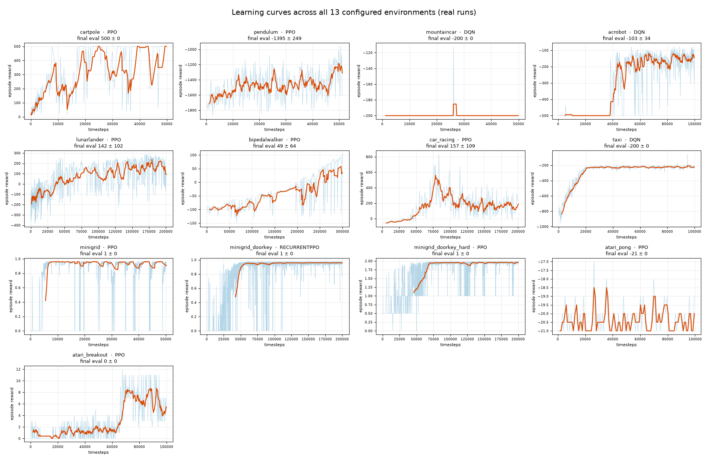
</div>

一眼能看出分化：CartPole、MiniGrid 系列、LunarLander、Acrobot 确实学起来了；MountainCar、Taxi、Atari Pong 则基本没动。**后者的原因不是「训得不够久」，而是策略坍缩**——证据在[诊断案例](#诊断案例什么才算学会)。

| 环境 | 算法 | 步数 | 最终评估 mean ± std | 观察 |
| --- | --- | ---: | --- | --- |
| `CartPole-v1` | PPO | 50k | **500.0 ± 0.0** | 满分（上限 500） |
| `MiniGrid-Empty-8x8` | PPO | 50k | **1.0 ± 0.0** | 满分，稳定 |
| `MiniGrid-DoorKey-5x5` | RecurrentPPO | 200k | **1.0 ± 0.0** | 满分 |
| `MiniGrid-DoorKey-6x6` | PPO | 200k | **0.9 ± 0.3** | 25 回合中约 22 次成功（含塑形） |
| `LunarLander-v3` | PPO | 200k | 142.4 ± 102.5 | 已学起，方差偏大 |
| `Acrobot-v1` | DQN | 100k | -103.0 ± 34.5 | 学起来了，未完全收敛 |
| `CarRacing-v3` | PPO | 200k | 157.2 ± 108.5 | 训练中期曾到 ~600 后退化 |
| `BipedalWalker-v3` | PPO | 300k | 48.5 ± 63.9 | 部分学会行走 |
| `Pendulum-v1` | PPO | 50k | -1395.2 ± 249.0 | 曲线仍在上升，明显欠训练 |
| `Atari Breakout` | PPO | 100k | 0.0 ± 0.0 | 策略坍缩到恒定 RIGHT |
| `Atari Pong` | PPO | 100k | -21.0 ± 0.0 | 退化为随机策略 |
| `Taxi-v4` | DQN | 100k | -200.0 ± 0.0 | 从不 pickup / dropoff |
| `MountainCar-v0` | DQN | 50k | -200.0 ± 0.0 | 未学会，仅 1 次偶然到达 |

> **跨环境不可直接比较**：各环境奖励尺度完全不同（CartPole 上限 500，Pendulum 是负值连续奖励，MiniGrid 每次成功 +1）。这张表用于对照同一环境的多次实验，不是排行榜。

失败结果保留在仓库里是**有意的**——它们正是「诊断」环节的素材。

### 策略演示

用训练好的最终策略录一段确定性回放，标注的是该回合的**实际回报**：

<table>
<tr>
<td align="center" width="33%"><b>CartPole-v1</b><br><sub>PPO · 满分 500</sub><br>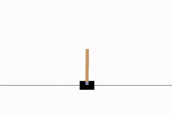</td>
<td align="center" width="33%"><b>MiniGrid-Empty-8x8</b><br><sub>PPO · 成功</sub><br>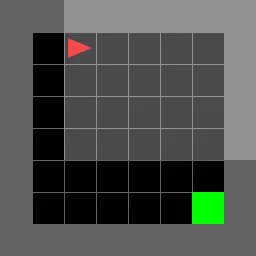</td>
<td align="center" width="33%"><b>MiniGrid-DoorKey-6x6</b><br><sub>PPO · 成功（受限视野 + 塑形）</sub><br>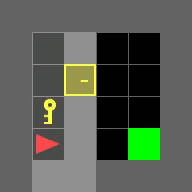</td>
</tr>
<tr>
<td align="center"><b>LunarLander-v3</b><br><sub>PPO · +182 成功着陆</sub><br>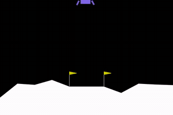</td>
<td align="center"><b>Acrobot-v1</b><br><sub>DQN · -89 摆起</sub><br>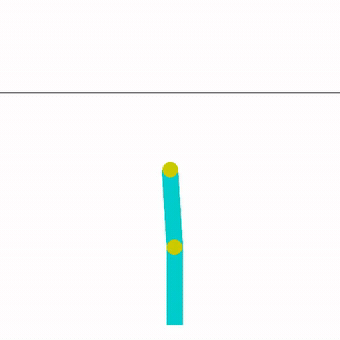</td>
<td align="center"><b>BipedalWalker-v3</b><br><sub>PPO · +111 蹒跚行走</sub><br>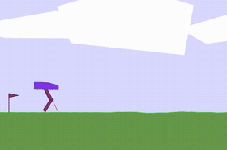</td>
</tr>
<tr>
<td align="center"><b>CarRacing-v3</b><br><sub>PPO · +117 像素输入驾驶</sub><br>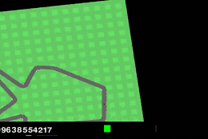</td>
<td align="center"><b>Pendulum-v1</b><br><sub>PPO · -1076 仍在学</sub><br>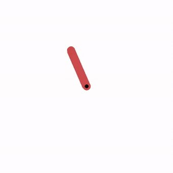</td>
<td align="center"><b>MiniGrid-DoorKey-5x5</b><br><sub>RecurrentPPO · 成功</sub><br>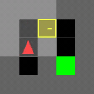</td>
</tr>
<tr>
<td align="center"><b>Taxi-v4</b><br><sub>DQN · -200 <b>未学会</b></sub><br>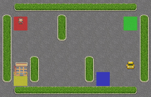</td>
<td align="center"><b>MountainCar-v0</b><br><sub>DQN · -200 <b>未学会</b></sub><br>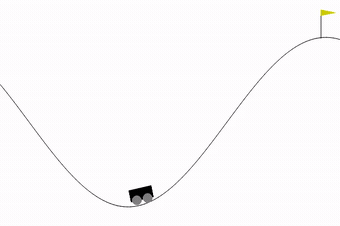</td>
<td align="center"><b>Atari Pong</b><br><sub>PPO · -21 <b>全输</b></sub><br>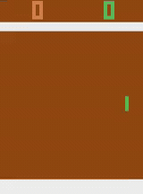</td>
</tr>
</table>

### 策略是怎么学会的

比「最终表现」更有意思的是中间过程。下面这组是同一个 LunarLander 回合——**同一初始条件、同一随机种子**——分别用 25k / 75k / 125k / 175k / 200k 步的 checkpoint 回放，只有策略不同：

<div align="center">
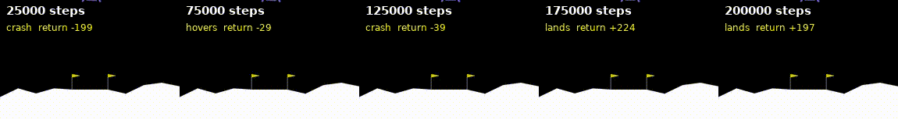
</div>

| 步数 | 回报 | 行为 |
| ---: | ---: | --- |
| 25k | -199 | 直接坠毁 |
| 75k | -29 | 学会悬停，但不敢降落，拖到超时 |
| 125k | -39 | **又退回去坠毁** |
| 175k | +224 | 稳定着陆 |
| 200k | +197 | 稳定着陆 |

「75k 会悬停、125k 反而坠毁」这一段尤其值得注意：**RL 的训练曲线不是单调上升的**，拿单个 checkpoint 的表现下结论很容易出错。用 `play.py --model <checkpoint>` 可以复现：

```bash
python play.py --config lunarlander \
  --model outputs/lunarlander/checkpoints/lunarlander_175000_steps.pt
```

---

## 快速开始

```bash
python -m venv .venv && source .venv/bin/activate
python -m pip install -r requirements.txt
```

以前每个环境一个目录、各带一份 `train.py`（11 份复制粘贴），现在统一成四个入口，由 `--config` 决定跑什么：

```bash
python train.py     --config cartpole        # 训练
python play.py      --config cartpole        # 录策略轨迹
python visualize.py --config cartpole        # 重画图、重录轨迹
python compare.py   --pattern 'cartpole*'    # 跨运行对比
```

`--config` 支持简写（`cartpole` 自动补成 `config/cartpole.yaml`）。

### 做对照实验

`--algorithm` / `--seed` / `--set` 让你不必来回改 YAML：

```bash
# 同一环境换种子，看方差有多大
python train.py --config cartpole --seed 0 --set output.directory=outputs/cp_s0
python train.py --config cartpole --seed 1 --set output.directory=outputs/cp_s1

# 自研实现 vs SB3 实现（读同一份 profile，超参完全一致）
python train.py --config cartpole --algorithm PPO     --set output.directory=outputs/ppo_native
python train.py --config cartpole --algorithm SB3-PPO --set output.directory=outputs/ppo_sb3
python compare.py --runs ppo_native --runs ppo_sb3

# 任意深度的覆盖，值按 YAML 语法解析
python train.py --config minigrid_doorkey_hard --set training.total_timesteps=2000
```

`--set` 的键**必须是配置里已存在的**——拼错会立刻报错并列出该层可用的键，而不是静默用默认值跑完。`play.py` / `visualize.py` 要传同样的 `--set`，否则会去找原始配置里的目录。

#### 变体实验：同一个算法的多份配置

上面回答的是「哪个算法好」。要回答「**同一个算法对什么敏感**」，得让同一个算法跑多份配置——学习率换一档、网络加宽一层、给环境加上风。`variants.py` 做这件事，变体定义放在 `config/variants/<配置名>.yaml`：

```yaml
variants:
  lr-1e-3:
    algorithm.profiles.<ALGO>.kwargs.learning_rate: 0.001
  net-64:
    algorithm.profiles.<ALGO>.policy_kwargs.net_arch: [64, 64]
  wind-strong:
    environment.kwargs.enable_wind: true
    environment.kwargs.wind_power: 15.0
    environment.kwargs.turbulence_power: 1.5
  budget-50k:
    training.total_timesteps: 50000
```

路径里的 `<ALGO>` 在展开时替换成该算法的 **profile 键**（去掉 `SB3-` 前缀），所以同一条覆盖能同时用在自研 `PPO` 与 `SB3-PPO` 上——那正是「同超参、只换实现」的对照所要求的。值按 YAML 语法解析，`true` / `0.001` / `[64, 64]` 都能表达。

```bash
# 扫 PPO 的学习率，两个实现一起跑；基准会自动带上做对照
python variants.py --config lunarlander --variants lr-1e-4 lr-1e-3 \
                   --algorithms PPO SB3-PPO --seeds 42 43

# 临时定义一个变体（名=点号路径=值），不写文件
python variants.py --config lunarlander \
    --variant 'lr-1e-4=algorithm.profiles.<ALGO>.kwargs.learning_rate=0.0001'

# 看清单与绑卡，不启动
python variants.py --config lunarlander --variants wind-strong --dry-run

# 流水线：探测到的每张卡上放 4 个任务，哪个槽空出来立刻补下一个，直到全部跑完
python variants.py --config lunarlander --variants lr-1e-3 net-64 --pipeline
```

用卡完全走探测与分配（`webui/gpus.py`）：**探测到几张卡就用几张**，一张卡上叠几个任务由 `--per-device` 给（默认 4），没有任何地方写死卡数。绑卡走 `CUDA_VISIBLE_DEVICES=GPU-<uuid>`，所以子进程里的设备恒为 `cuda:0`。

变体身份写进 `experiment.name`（`<配置名>__<变体名>`）并落在目录名里，因此：

- `resolved_config.yaml` 与 `evaluation.json` 里都带着变体名，事后从运行目录就能读回来；
- WebUI 的排行榜、对比页、筛选器都把 `(算法, 变体)` 分成独立的行——同一算法的多条**是同一个算法不同配置**，读作「这个算法对那个超参有多敏感」，与跨算法的差距不是一回事；
- 命令行发起的批次会写进 `webui/.state/jobs.json`，**自动出现在 WebUI 的「训练监控」页**里。

变体不适用时会**跳过而不是带着错跑**：`REINFORCE` 没有 profile，只改超参的变体对它无效；`DQN`/`TD3` 没有 `ent_coef`。这些组合在启动前就被拦下并说明原因。而覆盖值恰好等于配置默认值的变体（例如 `lr-3e-4` 对 PPO）会与基准去重——否则它只会白烧一张卡，并在排行榜上和基准并排出现两行一模一样的数字。

跑完之后，**WebUI 的「变体分析」页把整批结果折成结论**：每个变体在多少算法上一致变好/变差、跨算法的符号检验 p 值，以及逐算法的 `z`。这一页刻意先给出**噪声底线**再给效应表——这套实验里配置逐字段相同的两次运行（`SAC` 与 `SB3-SAC` 解析到同一个实现）的 3 种子平均 |Δ| 中位也有二三十、P90 近百，不先说这件事，每一行数字都会被读成效应。噪声的来源已经查清并且是这套数据里最值得记住的一条：

> **同一型号的显卡上跑同一个配置，结果是逐位相同的；换一个型号就会分叉，并会被 RL 的混沌性放大。**

实测：`DQN`/`SAC`/`TD3` 的孪生对里，**56 组同型号配对全部逐位相同**，106 组跨型号配对只有 17 组相同。所以变体与基准落在不同型号的卡上时，Δ 里混进的是**确定的硬件偏置**，不是随机噪声，事后无法从单个运行里剔除，只能靠调度时让对照与处理落在同型号的卡上来回避。分析页因此对每个配对都标注「跨型号」，并额外并排一列只用同型号配对的 `Δ均值（同型号）`。

WebUI 的读法（页面上的说明与这里一致）见 `webui/README.md` 的「变体分析怎么读」。

不想敲命令行也可以走 WebUI：「发起训练」页的**训练模式**切到「算法 × 变体 × 种子」，
勾变体集文件里的条目、点快捷预设（学习超参 / 网络宽度 / 环境扰动 / 训练预算 /
评估种子），或者在那张 `变体名 | 覆盖键 | 值` 长表里直接手填；启动前会逐条说清
哪些组合会被跳过或去重。表格编辑只活在这一次会话里，要留档就点「下载这份变体集」
放进 `config/variants/`。见 `webui/README.md` 的「变体模式」。

---

## 诊断案例：什么才算学会

这个项目真正的重点不在「跑通」，而在「说清回报为什么卡住」。框架会周期性采样动作分布写入 `logs/diagnostics.csv`：

<div align="center">
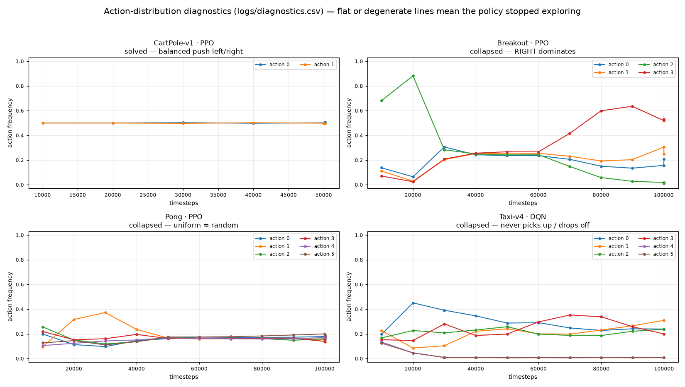
</div>

读图和读代码一样，关键看**形状**：

- **CartPole**（健康）：平在 0.5。倒立摆本来就要左右对称地推，平稳的 50/50 是正确信号。
- **Breakout**：`action 2` 先占主导（0.88），随后整个策略塌到 `action 3`（RIGHT）的 0.6。这正是它最终评估为 0 的原因——确定性评估取 argmax，于是永远选 RIGHT，挡板贴边不动，一分不得。
- **Pong**：6 个动作收敛到各 ~0.16 的均匀分布，策略退化成随机策略。
- **Taxi**：`action 4`（pickup）掉到 **0.007** 并贴地，策略学会「永远不接客」。

`logs/progress.csv` 里的训练信号是另一条线索。下面把两个**同为自研 PPO** 的运行并排对比——左边是学成的 CartPole，右边是死掉的 Pong：

<div align="center">
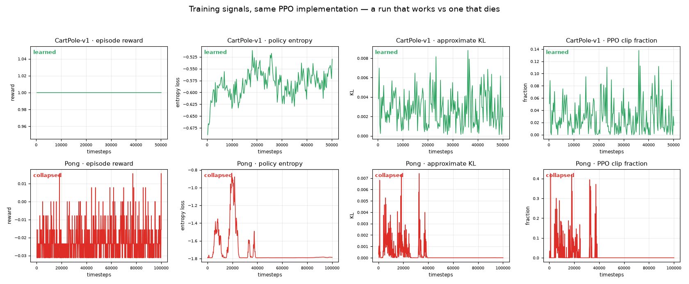
</div>

Pong 那一行在 40k 步之后发生了三件事：**熵锁定在 -1.79**（= ln 6，即 6 个动作上的最大熵，策略完全均匀随机）、**approx_kl 归零**、**clip fraction 归零**。KL 归零意味着策略已经不再更新了——不是「学得慢」，是训练**停摆**。

> 这三例都不是「训练不充分」。注意 Taxi 的回报曲线看起来还很「稳定收敛」——**光看回报根本发现不了问题，必须看动作分布。**

更多诊断（DoorKey 稀疏奖励、8x8 策略坍缩与熵正则修复）见 [`docs/minigrid_door_key.md`](docs/minigrid_door_key.md)。

---

## 项目结构

```
algorithms/          算法
├── base.py            统一接口 BaseAlgorithm
├── networks.py        策略网络（离散 Categorical / 连续 Gaussian）与价值网络
├── buffers.py         RolloutBuffer 与 GAE
├── on_policy.py       策略梯度类算法的公共骨架（训练循环、环境交互）
├── reinforce.py       自研：蒙特卡洛策略梯度
├── a2c.py             自研：优势 Actor-Critic
├── ppo.py             自研：带裁剪的 PPO
└── sb3_wrapper.py     Stable-Baselines3 适配器

environments/        环境构造
├── __init__.py        make_environment()：按配置建环境并套包装器
└── wrappers.py        MiniGrid 的观测拍平、探索奖励、进度塑形

rl_common/           框架
├── config.py          配置加载、路径解析、命令行覆盖
├── cli.py             入口共用的命令行参数
├── experiment.py      训练编排
├── training_log.py    episode 明细、动作分布诊断
└── visualization.py   训练曲线与策略轨迹

webui/               网页实验台（独立依赖，见 webui/README.md）
config/*.yaml        实验配置（唯一入口）
docs/                配图与专题文档
outputs/             训练产物的集中存放处（不入库）
```

### 算法

配置里改一行 `algorithm.name` 就能切换：

| 名字 | 来源 | 说明 |
| --- | --- | --- |
| `REINFORCE` | 自研 | 蒙特卡洛策略梯度，只有一行核心公式 |
| `A2C` | 自研 | 加价值基线降方差 + 熵正则 |
| `PPO` | 自研 | 加裁剪，支持同一批数据多轮更新 |
| `SB3-PPO` `SB3-A2C` `SB3-DQN` `SB3-SAC` `SB3-TD3` `SB3-RecurrentPPO` | SB3 | 对照基线与尚未自研的算法 |

`PPO` 在自研实现存在时指向自研，缺失时自动回退到 `SB3-PPO`；想要固定用某一种，写全名即可。

### 环境

| 配置 | Gymnasium 环境 | 默认算法 | 重点 |
| --- | --- | --- | --- |
| `cartpole` | `CartPole-v1` | PPO | 离散动作、最基础的倒立摆 |
| `taxi` | `Taxi-v4` | DQN | 接送乘客的离散规划 |
| `mountaincar` | `MountainCar-v0` | DQN | 通过积累动量爬坡 |
| `pendulum` | `Pendulum-v1` | PPO | 连续力矩控制 |
| `acrobot` | `Acrobot-v1` | DQN | 双连杆摆起 |
| `lunarlander` | `LunarLander-v3` | PPO | 离散/连续动作着陆 |
| `minigrid` | `MiniGrid-Empty-8x8-v0` | PPO | 紧凑的网格导航 |
| `bipedalwalker` | `BipedalWalker-v3` | PPO | 双足机器人行走 |
| `car_racing` | `CarRacing-v3` | PPO | 像素输入的连续驾驶 |
| `atari_pong` | `ALE/Pong-v5` | PPO | Atari 对抗式像素控制 |
| `atari_breakout` | `ALE/Breakout-v5` | PPO | Atari 像素控制 |
| `minigrid_doorkey` | `MiniGrid-DoorKey-5x5-v0` | RecurrentPPO | 稀疏奖励下的信用分配 |
| `minigrid_doorkey_hard` | `MiniGrid-DoorKey-6x6-v0` | PPO | 稀疏奖励 + 进度塑形 |

环境构造集中在 `environments/`，由配置的 `environment` 段决定用哪个环境、套哪些包装器：

```yaml
environment:
  id: MiniGrid-DoorKey-6x6-v0
  wrappers: [minigrid_progress, minigrid_flat]   # 进度塑形 + 观测拍平
  shaping_pickup_bonus: 0.5
```

| 包装器 | 作用 |
| --- | --- |
| `minigrid_flat` | 图像与朝向编码成一维向量，移除文本 mission |
| `minigrid_novelty` | `(x, y, direction)` 计数式内在奖励（参数 `novelty_scale`） |
| `minigrid_progress` | DoorKey 进度塑形（参数 `shaping_pickup_bonus` / `shaping_door_bonus`） |

两个奖励类包装器**只在训练时生效**：评估与轨迹录制会自动禁用它们，所以 `evaluation.json` 的回报和录制的视频始终反映未塑形的任务奖励。

---

## 训练产物

每次训练写到 `output.<directory>`（默认 `outputs/<配置名>`）：

```
resolved_config.yaml              本次运行实际生效的配置
evaluation.json                   最终评估的汇总（也是「跑完」的标志）
final_model.{pt,zip}              自研算法存 .pt，SB3 存 .zip
logs/train.monitor.csv            每个训练 episode 的回报与长度
logs/progress.csv                 每个 rollout 的训练信号（损失、熵、KL...）
logs/episodes.csv                 每个 episode 的明细
logs/diagnostics.csv              周期性记录的动作分布
evaluation/evaluations.npz        周期评估的原始结果
checkpoints/*.{zip,pt}            周期性模型快照
best_model/best_model.{zip,pt}    周期评估中最优的模型
visualizations/*.png              训练曲线
trajectories/*.{mp4,png,npz,csv}  策略轨迹
```

<details>
<summary><b>轨迹图与训练曲线示例</b></summary>

<br>

轨迹图包含观测特征、动作、单步/累计奖励和 phase plot：

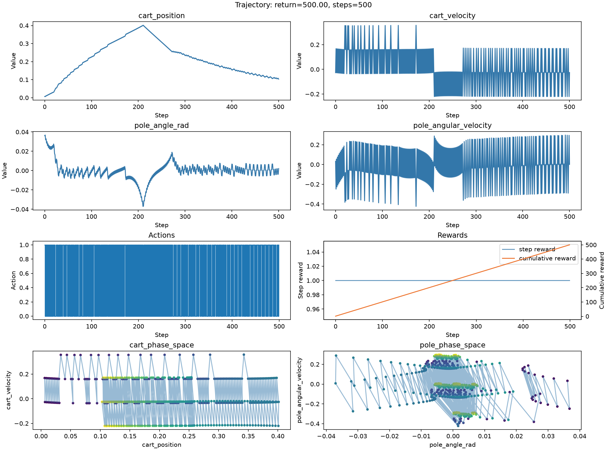

训练曲线四联图（回合回报 / 回合长度 / 周期评估 / 最终评估分布）：

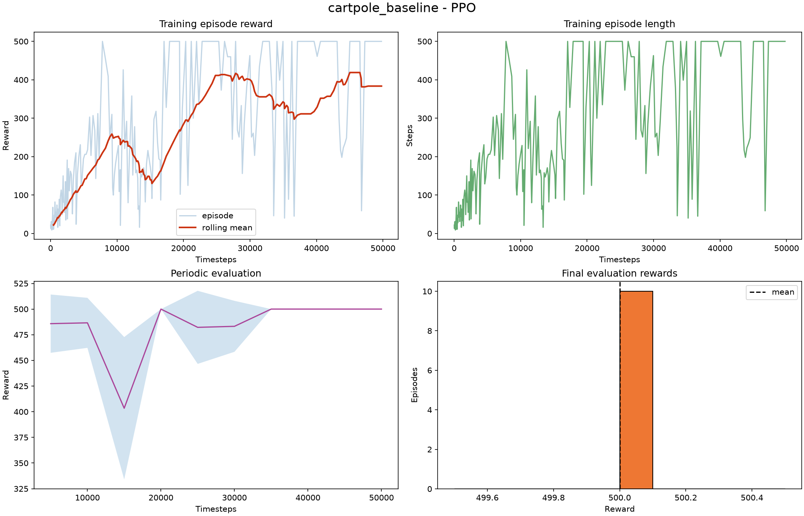

稀疏奖励环境对照（DoorKey-6x6，可见 50k 步前长期零回报，之后随塑形信号突破）：

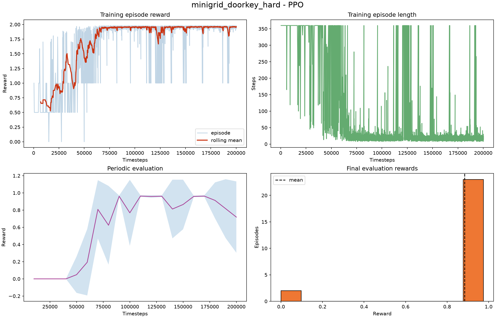

</details>

---

## 其他

- **小网络要限制 torch 线程数**。在 256 核机器上实测小 LSTM 策略**单线程快约一倍**（128 线程 224 FPS → 单线程 462 FPS），线程同步开销超过并行收益。配置项 `experiment.torch_threads` 控制；像素环境的 CNN 结论相反，所以是 opt-in 而非全局默认。
- **自研算法的 `predict` 刻意对齐 SB3 的返回形状约定**，因此框架里现成的周期评估、checkpoint、可视化工具都能直接驱动它们。
- `requirements.txt` 里的 `sb3-contrib` 只被 `RecurrentPPO` 用到，是可选依赖。
- 无桌面环境默认用 `rgb_array` 录制 MP4；要弹实时窗口，把 YAML 里 `record_video` 设为 `false`、`show_window` 设为 `true`。

<div align="center">
<br>
<sub>环境的推荐学习顺序、每个环境该看什么、该做哪些对照实验 —— 见 <a href="LEARNING_PATH.md"><b>LEARNING_PATH.md</b></a></sub>
</div>
