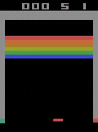

# 最小 RL 实验

一个配置驱动的强化学习实验框架：环境、算法、超参、日志全部由 YAML 决定。
既包含**从零手写**的策略梯度算法（带详细中文注释），也保留 Stable-Baselines3
作为对照基线。

> 环境的推荐学习顺序、每个环境该看什么、该做哪些对照实验，见
> [`LEARNING_PATH.md`](LEARNING_PATH.md)。

## 结果总览

13 个配置各跑一次，下图是**真实训练曲线**（数据来自各运行目录的
`logs/train.monitor.csv`，浅色为逐回合回报，深色为滑动平均）：


一眼能看出分化的两类：CartPole、MiniGrid 系列、LunarLander、Acrobot 确实学起来了；
MountainCar、Taxi、Atari Pong 则基本没动。**后者的原因不是"训得不够久"，而是策略
坍缩**——证据在下面的「训练产物」一节。

全部 13 次运行的真实评估数字（`evaluation.json`，每环境 3–25 回合，seed 42）：

| 环境 | 算法 | 步数 | 最终评估 mean ± std | 观察 |
| --- | --- | ---: | --- | --- |
| CartPole-v1 | PPO | 50k | **500.0 ± 0.0** | 满分（上限 500） |
| MiniGrid-Empty-8x8 | PPO | 50k | **1.0 ± 0.0** | 满分，稳定 |
| MiniGrid-DoorKey-5x5 | RecurrentPPO | 200k | **1.0 ± 0.0** | 满分 |
| MiniGrid-DoorKey-6x6 | PPO | 200k | **0.9 ± 0.3** | 25 回合中约 22 次成功（含 shaping） |
| LunarLander-v3 | PPO | 200k | 142.4 ± 102.5 | 已学起，方差偏大 |
| Acrobot-v1 | DQN | 100k | -103.0 ± 34.5 | 学起来了，未完全收敛 |
| CarRacing-v3 | PPO | 200k | 157.2 ± 108.5 | 训练中期曾到 ~600 后退化 |
| BipedalWalker-v3 | PPO | 300k | 48.5 ± 63.9 | 部分学会行走 |
| Pendulum-v1 | PPO | 50k | -1395.2 ± 249.0 | 曲线仍在上升，明显欠训练 |
| Atari Breakout | PPO | 100k | 0.0 ± 0.0 | 策略坍缩到恒定 RIGHT |
| Atari Pong | PPO | 100k | -21.0 ± 0.0 | 退化为随机策略 |
| Taxi-v4 | DQN | 100k | -200.0 ± 0.0 | 从不 pickup / dropoff |
| MountainCar-v0 | DQN | 50k | -200.0 ± 0.0 | 未学会，仅 1 次偶然到达 |

> ⚠️ **跨环境不可直接比较**：各环境奖励尺度完全不同（CartPole 上限 500，Pendulum
> 是负值连续奖励，MiniGrid 每次成功 +1）。这张表用于对照同一环境的多次实验，
> 不是排行榜。

这些失败结果保留在仓库里是**有意的**——它们正是 `LEARNING_PATH.md` 里「诊断」
环节的素材：能跑通环境的人很多，能说清「回报为什么卡住」的才算入门。

## 策略演示

每个环境用训练好的最终策略录一段确定性回放（`play.py`，`deterministic=true`）。
标注的是**该回合的实际回报**：

<table>
<tr>
<td align="center" width="33%"><b>CartPole-v1</b><br><sub>PPO · 满分 500</sub><br></td>
<td align="center" width="33%"><b>MiniGrid-Empty-8x8</b><br><sub>PPO · 成功</sub><br></td>
<td align="center" width="33%"><b>MiniGrid-DoorKey-6x6</b><br><sub>PPO · 成功（瘦身视界 + shaping）</sub><br></td>
</tr>
<tr>
<td align="center"><b>LunarLander-v3</b><br><sub>PPO · +182 成功着陆</sub><br></td>
<td align="center"><b>Acrobot-v1</b><br><sub>DQN · -89 摆起</sub><br></td>
<td align="center"><b>BipedalWalker-v3</b><br><sub>PPO · +111 蹒跚行走</sub><br></td>
</tr>
<tr>
<td align="center"><b>CarRacing-v3</b><br><sub>PPO · +117 像素输入驾驶</sub><br></td>
<td align="center"><b>Pendulum-v1</b><br><sub>PPO · -1076 仍在学</sub><br></td>
<td align="center"><b>MiniGrid-DoorKey-5x5</b><br><sub>RecurrentPPO · 成功</sub><br></td>
</tr>
<tr>
<td align="center"><b>Taxi-v4</b><br><sub>DQN · -200 <b>未学会</b>（从不接客）</sub><br></td>
<td align="center"><b>MountainCar-v0</b><br><sub>DQN · -200 <b>未学会</b></sub><br></td>
<td align="center"><b>Atari Pong</b><br><sub>PPO · -21 <b>全输</b>（退化为随机）</sub><br></td>
</tr>
<tr>
<td align="center"><b>Atari Breakout</b><br><sub>PPO · 0 <b>策略坍缩</b></sub><br></td>
<td align="center" colspan="2"></td>
</tr>
</table>

### 策略是怎么学会的

比"最终表现"更有意思的是**中间过程**。下面这组是同一个 LunarLander 回合
（**同一初始条件、同一随机种子**）分别用 25k / 75k / 125k / 175k / 200k 步的
checkpoint 回放，只有策略不同：


- **25k**：直接坠毁（-199）
- **75k**：学会悬停，但不敢降落，拖到 1000 步超时（-29）
- **125k**：又会坠毁（-39）—— 中间过程并不是单调变好的
- **175k / 200k**：稳定着陆（+224 / +197）

"75k 会悬停、125k 反而坠毁"这一段尤其值得注意：**RL 的训练曲线不是单调上升的**，
拿单个 checkpoint 的表现下结论很容易出错。这个 GIF 用
`play.py --model <checkpoint>` 就能复现：

```bash
python play.py --config lunarlander \
  --model outputs/lunarlander/checkpoints/lunarlander_175000_steps.pt
```

## 目录结构

```
algorithms/          算法
├── base.py            统一接口 BaseAlgorithm
├── networks.py        策略网络（离散 Categorical / 连续 Gaussian）与价值网络
├── buffers.py         RolloutBuffer 与 GAE
├── on_policy.py       策略梯度类算法的公共骨架（训练循环、环境交互）
├── reinforce.py       自研：蒙特卡洛策略梯度
├── a2c.py             自研：优势 Actor-Critic
├── ppo.py             自研：带裁剪的 PPO
└── sb3_wrapper.py     Stable-Baselines3 适配器

environments/        环境构造
├── __init__.py        make_environment()：按配置建环境并套包装器
└── wrappers.py        MiniGrid 的观测拍平、探索奖励、进度塑形

rl_common/           框架
├── config.py          配置加载、路径解析、命令行覆盖
├── cli.py             三个入口共用的命令行参数
├── experiment.py      训练编排
├── training_log.py    episode 明细、动作分布诊断
└── visualization.py   训练曲线与策略轨迹

config/*.yaml        实验配置（唯一入口）
docs/                配图与专题文档
├── images/            训练曲线、诊断图
├── images/demos/      策略回放 GIF（演示与训练进化）
└── minigrid_door_key.md
webui/               网页实验台（独立依赖，见 webui/README.md）
outputs/             训练产物的集中存放处（不入库）
```

## 安装

```bash
python -m venv .venv
source .venv/bin/activate
python -m pip install -r requirements.txt
```

## 快速开始

```bash
python train.py --config cartpole
```

以前每个环境一个目录、各带一份 `train.py`（11 份复制粘贴），现在统一成三个入口，
由 `--config` 决定跑什么。新增实验只需要加一份 YAML。

```bash
python train.py --config cartpole                      # 训练
python play.py --config cartpole                       # 录策略轨迹
python visualize.py --config cartpole                  # 重画图、重录轨迹
python compare.py --pattern 'cartpole*'                # 跨运行对比
```

### WebUI

不想盯着终端时，可以用网页界面看实验进度和结果，也能直接发起训练：

```bash
python -m pip install -r webui/requirements.txt        # 独立依赖，跑实验不需要
streamlit run webui/app.py
```

服务只监听 `127.0.0.1`，无桌面服务器上配合 SSH 端口转发访问：

```bash
ssh -N -L 8501:127.0.0.1:8501 <user>@<服务器>          # 然后开 http://127.0.0.1:8501
```

五个页面：**运行总览**（所有实验的状态与回报）、**运行详情**（曲线/信号/动作诊断/
轨迹视频/产物）、**跨运行对比**、**发起训练**（表单 + 实时命令行预览）、
**训练监控**（进度条 + 实时曲线 + 日志尾）。

训练以子进程方式启动，**独立于页面运行**——关掉浏览器不会中断。详见
[`webui/README.md`](webui/README.md)。

### 做对照实验

`--algorithm` / `--seed` / `--set` 让你不必来回改 YAML：

```bash
# 同一环境换种子，看方差有多大
python train.py --config cartpole --seed 0 --set output.directory=outputs/cp_s0
python train.py --config cartpole --seed 1 --set output.directory=outputs/cp_s1

# 自研实现 vs SB3 实现（读同一份 profile，超参完全一致）
python train.py --config cartpole --algorithm PPO     --set output.directory=outputs/ppo_native
python train.py --config cartpole --algorithm SB3-PPO --set output.directory=outputs/ppo_sb3

python compare.py --runs ppo_native --runs ppo_sb3

# 任意深度的覆盖，值按 YAML 语法解析
python train.py --config minigrid_doorkey_hard --set training.total_timesteps=2000
```

注意 `play.py` / `visualize.py` 要传**同样的** `--set`，否则会去找原始配置里的目录。

## 算法

配置里改一行 `algorithm.name` 就能切换：

| 名字 | 来源 | 说明 |
| --- | --- | --- |
| `REINFORCE` | 自研 | 蒙特卡洛策略梯度，只有一行核心公式 |
| `A2C` | 自研 | 加价值基线降方差 + 熵正则 |
| `PPO` | 自研 | 加裁剪，支持同一批数据多轮更新 |
| `SB3-PPO` / `SB3-A2C` / `SB3-DQN` / `SB3-SAC` / `SB3-TD3` / `SB3-RecurrentPPO` | SB3 | 对照基线与尚未自研的算法 |

**自研实现与 SB3 实现读同一份 profile**（YAML 里的 `PPO:` 段），所以对照实验天然
同超参——学习曲线的差异才能归因到实现本身。`PPO` 在自研实现存在时指向自研，
缺失时自动回退到 `SB3-PPO`；想要固定用某一种，写全名即可。

自研算法刻意不复用 SB3 的训练循环：亲手写一遍「采样 → 算优势 → 算损失 → 反向传播」
这条链路才是这个项目的意义。注释里写明了策略梯度定理、baseline 为什么能降方差、
GAE 的 λ 在做什么、PPO 的 clip 到底限制了什么东西。

## 环境

| 配置 | Gymnasium 环境 | 默认算法 | 重点 |
| --- | --- | --- | --- |
| `cartpole.yaml` | `CartPole-v1` | PPO | 离散动作、最基础的倒立摆 |
| `taxi.yaml` | `Taxi-v4` | DQN | 接送乘客的离散规划 |
| `mountaincar.yaml` | `MountainCar-v0` | DQN | 通过积累动量爬坡 |
| `pendulum.yaml` | `Pendulum-v1` | PPO | 连续力矩控制 |
| `acrobot.yaml` | `Acrobot-v1` | DQN | 双连杆摆起 |
| `lunarlander.yaml` | `LunarLander-v3` | PPO | 离散/连续动作着陆 |
| `minigrid.yaml` | `MiniGrid-Empty-8x8-v0` | PPO | 紧凑的网格导航 |
| `bipedalwalker.yaml` | `BipedalWalker-v3` | PPO | 双足机器人行走 |
| `car_racing.yaml` | `CarRacing-v3` | PPO | 像素输入的连续驾驶 |
| `atari_pong.yaml` | `ALE/Pong-v5` | PPO | Atari 对抗式像素控制 |
| `atari_breakout.yaml` | `ALE/Breakout-v5` | PPO | Atari 像素控制 |
| `minigrid_doorkey.yaml` | `MiniGrid-DoorKey-5x5-v0` | RecurrentPPO | 稀疏奖励下的信用分配 |
| `minigrid_doorkey_hard.yaml` | `MiniGrid-DoorKey-6x6-v0` | PPO | 稀疏奖励 + 进度塑形 |

环境构造集中在 `environments/`，由配置的 `environment` 段决定用哪个环境、套哪些
包装器：

```yaml
environment:
  id: MiniGrid-DoorKey-6x6-v0
  wrappers: [minigrid_progress, minigrid_flat]   # 进度塑形 + 观测拍平
  shaping_pickup_bonus: 0.5
```

可用的包装器：

| 名称 | 作用 |
| --- | --- |
| `minigrid_flat` | 图像与朝向编码成一维向量，移除文本 mission |
| `minigrid_novelty` | `(x, y, direction)` 计数式内在奖励（参数 `novelty_scale`） |
| `minigrid_progress` | DoorKey 进度塑形（参数 `shaping_pickup_bonus` / `shaping_door_bonus`） |

两个奖励类包装器**只在训练时生效**：评估与轨迹录制会自动禁用它们，所以
`evaluation.json` 的回报和录制的视频始终反映未塑形的任务奖励。

## 训练产物

每次训练写到 `output.<directory>`（配置里默认是 `outputs/<配置名>`）：

```
logs/train.monitor.csv        每个训练 episode 的回报与长度
logs/progress.csv             每个 rollout 的训练信号（损失、熵、KL、解释方差...）
logs/episodes.csv             每个 episode 的明细（含累计步数与耗时）
logs/diagnostics.csv          周期性记录的动作分布与策略统计
evaluation/evaluations.npz    周期评估的原始结果
evaluation.json               最终评估的汇总
checkpoints/*.{zip,pt}        周期性模型快照
best_model/best_model.{zip,pt} 周期评估中最优的模型
visualizations/*.png          训练曲线
trajectories/*.{mp4,png,npz,csv}  策略轨迹
resolved_config.yaml          本次运行实际生效的配置
```

自研算法存 `.pt`，SB3 存 `.zip`，加载时按配置里的算法名自动识别。

`logs/diagnostics.csv` 里的**动作分布**是排查训练失败的关键证据。DoorKey-8x8
的案例就是靠它定位的：`pickup` 占 37.9%、`drop` 占 31.9%、`toggle` 占 **0.0%**，
直接说明问题是策略坍缩而不是探索不足（详见 `docs/minigrid_door_key.md`）。

下面这张图是同一份诊断数据在四个环境上的样子，用于对照「健康」与「坍缩」：


- **CartPole**（健康）：平在 0.5。倒立摆本来就要左右对称地推，平稳的 50/50 是正确信号。
- **Breakout**：`action 2` 先占主导（0.88），随后整个策略塌到 `action 3`（RIGHT）的
  0.6。这正是它最终评估为 0 的原因——确定性评估取 argmax，于是永远选 RIGHT，
  挡板贴边不动，一分不得。
- **Pong**：6 个动作收敛到各 ~0.16 的均匀分布，策略退化成随机策略，评估 -21。
- **Taxi**：`action 4`（pickup）掉到 **0.007** 并贴地，策略学会「永远不接客」，
  于是恒定 -200。

这三例都不是「训练不充分」。注意 Taxi 的回报曲线看起来还很「稳定收敛」，
**光看回报根本发现不了问题，必须看动作分布**。

`logs/progress.csv` 里的训练信号是另一条线索。下面把两个**同为自研 PPO** 的运行
并排对比——左边是学成的 CartPole，右边是死掉的 Pong：


Pong 那一行在 40k 步之后发生了三件事：**熵锁定在 -1.79**（= ln 6，即 6 个动作上的
最大熵，策略完全均匀随机）、**approx_kl 归零**、**clip fraction 归零**。KL 归零意味着
策略已经不再更新了——不是"学得慢"，是训练**停摆**了。这类失效单看回报曲线同样
看不出来。

轨迹图包含观测特征、动作、单步/累计奖励和 phase plot：


训练曲线四联图（回合回报 / 回合长度 / 周期评估 / 最终评估分布）：


稀疏奖励环境的对照（DoorKey-6x6，可见 50k 步前长期零回报，之后随塑形信号突破）：


## 其他

- 框架会自动为 mm 级的小网络把 torch 线程数限制为单线程（配置里的
  `experiment.torch_threads`）：在 256 核机器上实测小 LSTM 策略单线程快约一倍。
  像素环境用的 CNN 结论相反，所以这是 opt-in 而非全局默认。
- 自研算法的 `predict` 刻意对齐 SB3 的返回形状约定，因此框架里现成的周期评估、
  checkpoint、可视化工具都能直接驱动它们。
- `requirements.txt` 里的 `sb3-contrib` 只被 `RecurrentPPO` 用到，是可选依赖。
